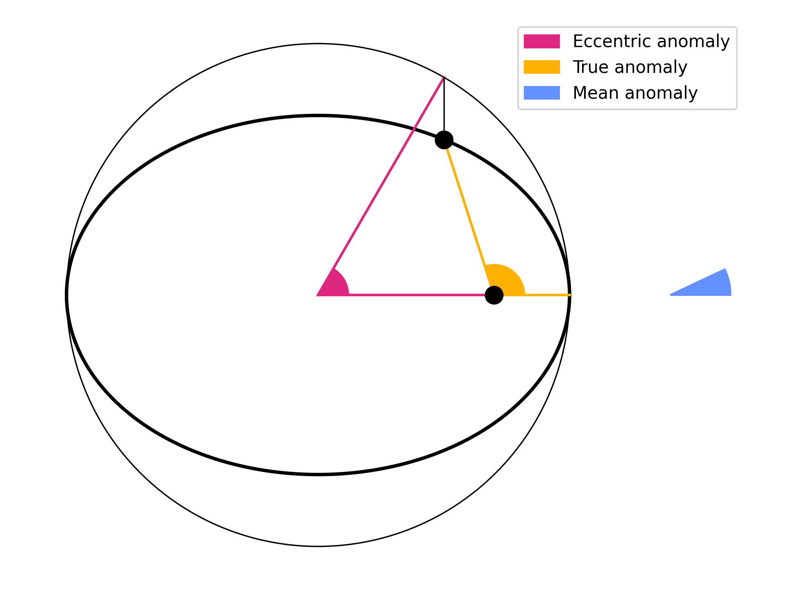

# Anomalies visualization

Keplerian orbits can be parametrized in different ways. 
In order to make sense of it I made this visualization, which might be helpful 
to other people.
The video can be found [here](https://www.youtube.com/watch?v=Mr9t7SLo0I0).

### Running the code

The video and the picture can be reproduced by running the script `kepler.py`, 
as `python kepler.py`.
Before doing so, one may install the necessary dependencies with `pip insall -r requirements.txt`.

The conversion functions are tested in `test_conversion.py`; one may run the 
tests by running `pytest`.

### Definitions

A generic eccentric orbit is described by an ellipse, with semimajor axis $a$ and semiminor axis $b$, so its points obey the equation
$$\frac{x^2}{a^2} + \frac{y^2}{b^2} = 1$$

The *eccentricity* $e$ is defined by $e^2 = 1- ( b / a)^2$.
The *focal distance* $c$ is $c = \sqrt{ a^{2} - b^{2} }$.

The *eccentric anomaly* $E$ is the angle from the periastron to the *projection* of the orbiting body onto the smallest circle containing the ellipse, measured using the *center of the ellipse* as the center.

The *true anomaly* $f$ is the angle from the periastron to the orbiting body, measured using the *focus of the ellipse* as the center.

The *mean anomaly* $M$ is an angle increasing proportionally to time from a periastron pass to the next.

### Conversions

Mean anomaly and eccentric anomaly are related through Kepler's equation, which is transcendental and therefore must be solved numerically:
$$M = E - e \sin E$$

True anomaly and eccentric anomaly are related through the equation:
$$(1 - e) \tan^2(f/2) = (1+e) \tan^2(E/2)$$

but solving it is numerically unstable (the tangent diverges), so there is a [better way](https://ui.adsabs.harvard.edu/abs/1973CeMec...7..388B/abstract):
define $\beta = e / (1 + \sqrt(1-e^2))$, then
$$f = E + 2 \text{atan2}(\beta \sin E, 1 - \beta \cos E)$$

where $\text{atan2}(y / x) \sim \arctan( y / x)$ is the two-argument tangent function, which is also stable for $x=0$.

Finally, one may close the circle of conversions with the following relation:
$$M = \text{atan2}(-\sqrt{ 1-e^{2} \sin f }, -e - \cos f) + \pi -e \frac{\sqrt{ 1 - e^{2} } \sin f}{1+e \cos f}$$

